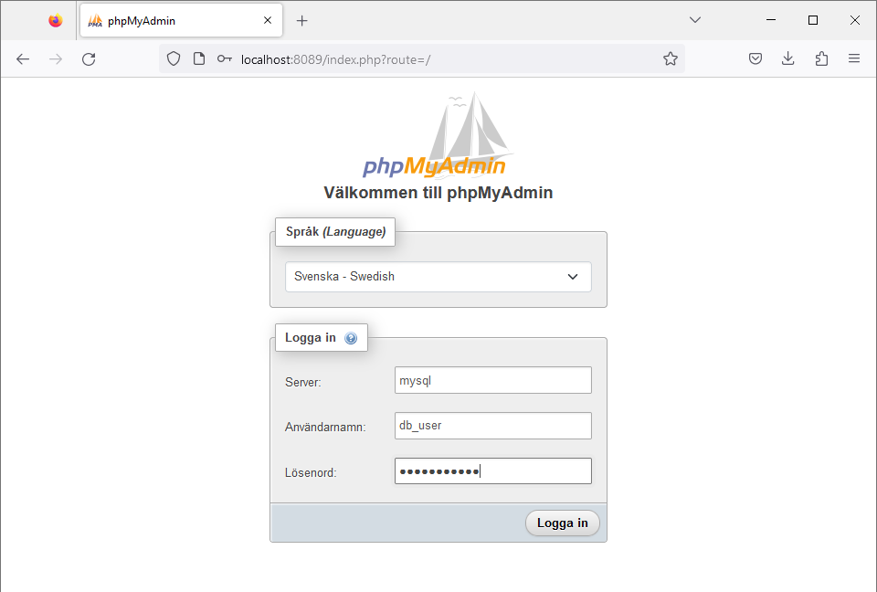
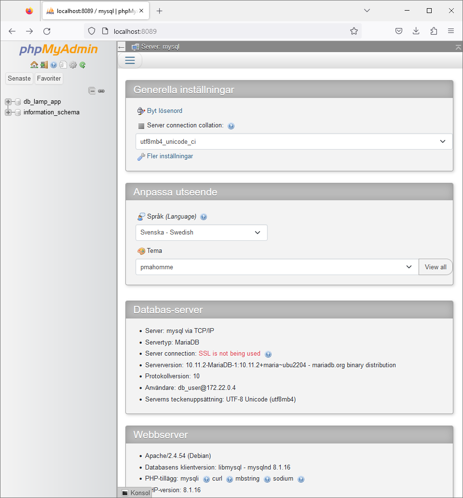
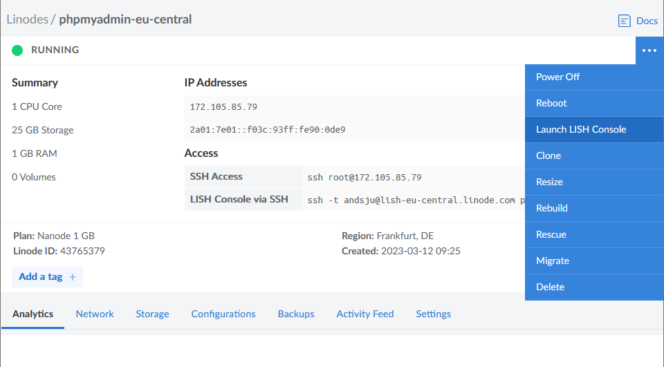
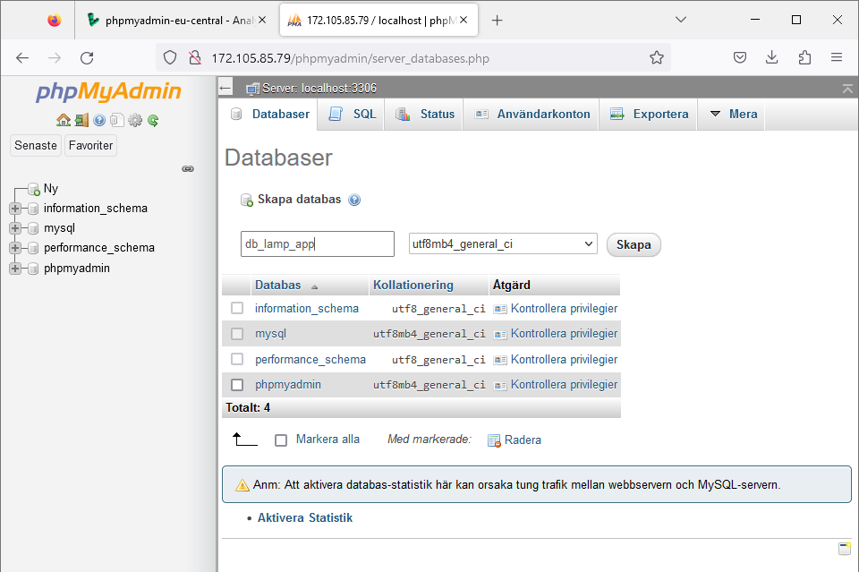
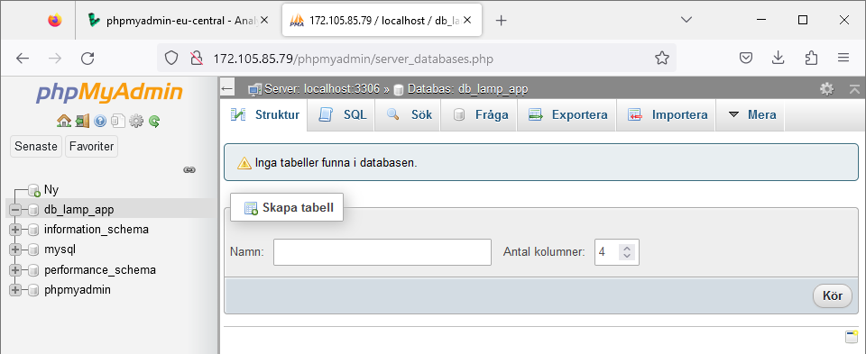
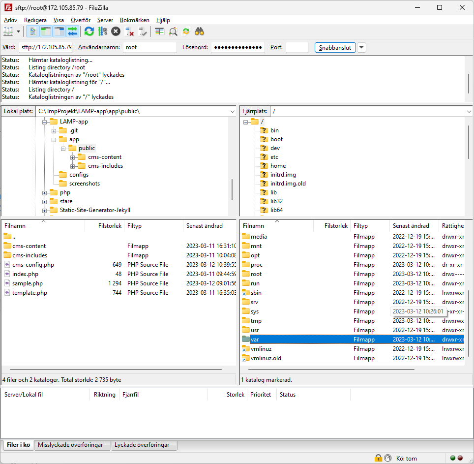
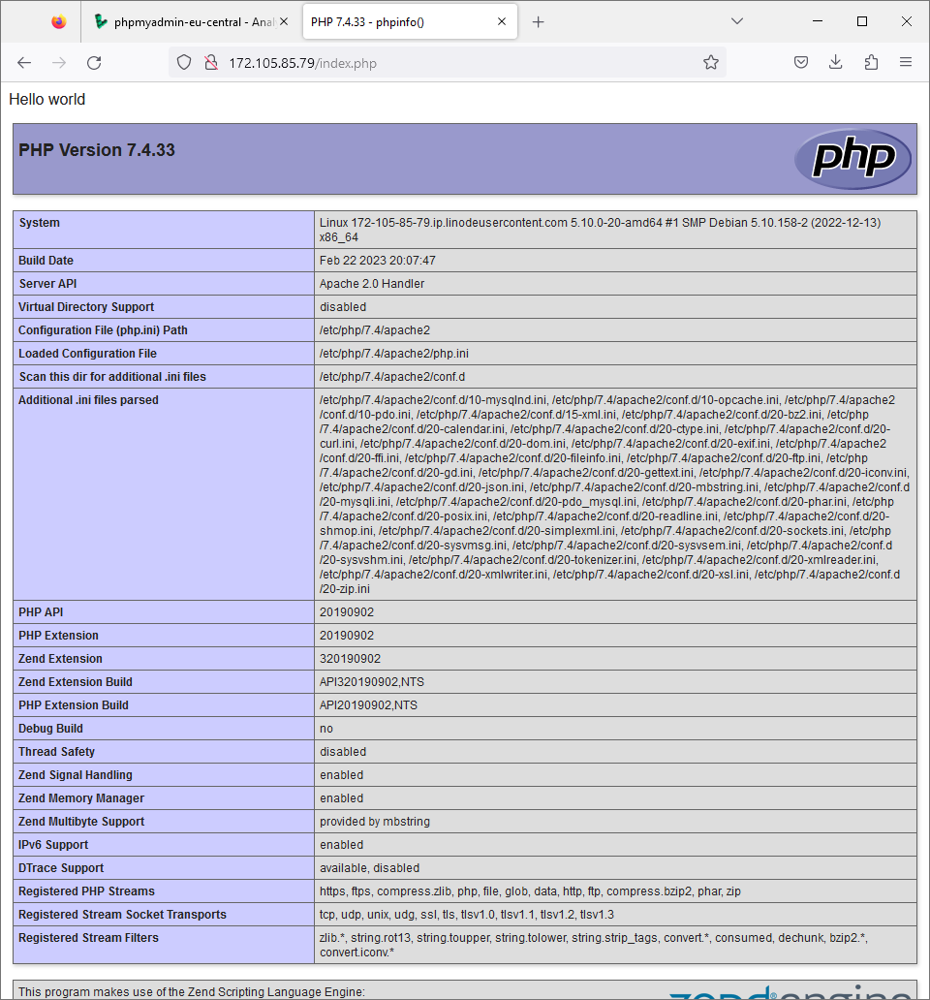

# LAMP-app

---

<p>&nbsp;</p>
**OBS!** Ändra namnet på filen `app/public/cms-config-template.php` till `app/public/cms-config.php`. Se instruktioner nedan.
<p>&nbsp;</p>

---


Gitrepot är ett startprojekt baserad på en LAMP-stack - Linux, Apache, MySQL (MariaDB), PHP. Projektet kan användas i en inledande fas för att koda ett projekt som (https://github.com/Glimakra-Webbutvecklare-2021/case-fullstack-php).


Guiden beskriver en tänkbar mappstruktur för utveckling i Docker (lokal miljö),  produktionssatt med Linode (publik miljö). I Linode används appen `phpMyAdmin`. En LAMP stack (PHP version 7.4) med tillgång till phpMyAdmin.

---

Förslag på hur katalogstrukturen i ett CMS (namngivning av filer, mappar, och struktur liknar Wordpress):

Jfr

- wp-content
- wp-includes
- wp-config.php

...

- cms-content
- cms-includes 
- cms-config.php

---

Mappen `public` motsvarar en webservers sökväg till: 

`/var/www/html`

Strukturen innebär att innehållet i mappen `public` enkelt kan överföras med en FTP klient till en publik webbserver. 

*Används ramverk i PHP (ex composer eller Laravel), behöver applikationen även ha tillgång till `/user/share`.*

---

```md

project
├── app
│   ├── public
│   │   ├── cms-content
│   │   │   ├── styles
│   │   │   │   └── style.css
│   │   │   └── images
│   │   │   └── uploads
│   │   ├── cms-includes
│   │   │   ├── models
│   │   │   │   └── Database.php
│   │   │   ├── partials
│   │   │   │   └── header.php
│   │   │   ├── global-functions.php
│   │   │   └── .htaccess
│   │   └── cms-config-template.php 
│   │   └── cms-config.php
│   │   └── index.php
│   │   └── sample.php
├── configs
│   ├── custom-apache2.conf
│   └── custom-php.ini
├── docker-compose.yml
├── Dockerfile

```

I mappstrukturen ovan används `.htaccess` i mappen `cms-includes`. Inställningarna i den filen innebär att filer endast kan inkluderas av applikationen, och inte genom att någon anger sökvägen i en url. 

```htaccess
# Refuse direct access to all files
Order deny,allow
Deny from all
```

---

<p>&nbsp;</p>

## Docker - development

I `docker-compose.yml` finns följande instruktioner:

```yml
version: '3'
services:
    apache:
        build:
            context: .
            dockerfile: Dockerfile
        volumes:
            - ./app/public:/var/www/html
            - ./configs/custom-apache2.conf:/etc/apache2/apache2.conf
            - ./configs/custom-php.ini:/usr/local/etc/php/php.ini
        ports:
            - "8088:80"
    mysql:
        image: mariadb:latest
        environment:
            MYSQL_ROOT_PASSWORD: 'db_root_password'
            MYSQL_USER: 'db_user'
            MYSQL_PASSWORD: 'db_password'
            MYSQL_DATABASE: 'db_lamp_app'
        volumes:
            - mysqldata:/var/lib/mysql
        ports:
            - 33061:3306
    phpmyadmin:
        image: phpmyadmin
        restart: always
        ports:
            - 8089:80
        environment:
            - PMA_ARBITRARY=1
        depends_on:
            - mysql
volumes:
    mysqldata: {}      
```

I `Dockerfile` anges vidare instruktioner för apache (och php). PHP versionen motsvarar den version som finns i Linodes app `phpmyadmin`.

```Dockerfile
# PHP version 7|8
FROM php:7.4-apache
# FROM php:8.0-apache
RUN a2enmod rewrite
RUN service apache2 restart
RUN docker-php-ext-install pdo pdo_mysql 
```

---

**För att testa repot** nedan kan du klona ner det och göra enligt guiden nedan. **För att använda repot som ett startprojektet** skapa ett eget versionshanterat projekt, och därefter manuellt skapa mappstruktur och filer enligt det här projektet. Då kan du själv överväga justeringar av kod, filnamn, strukur...

---


Öppna en terminal och kör kommandot:

`docker-compose up`

Starta en webbläsare och navigera till `localhost:8088`. Filen `index.php` använder `phpinfo()` för att visa gällande inställningar.


---

### phpMyAdmin

---

Navigera till  `localhost:8089`

Logga in med de uppgifter som finns i `docker-compose.yml`

*Server:* **mysql**

*Användarnamn:* **db_user**

*Lösenord:* **db_password**



När du loggat in visas den databas som skapades i samband med att instruktiner kördes i `docker-compose.yml`: **db_lamp_app**



Navigera till `localhost:8088/template.php`. 
Sidan visar header, footer och ett nav element via php include(). Sidan inkluderar filer som är användbara i en applikation.

```php
include_once 'cms-config.php';
include_once ROOT . '/cms-includes/global-functions.php';
include_once ROOT . '/cms-includes/models/Database.php';
```

Här visas också aktuell databas. Information som printas ut via databas modellen - se `/cms-includes/models/Database.php`.

Klassen Database kan andra modeller använda i applikationen.

```php
class Database {

    protected $db;

    protected function __construct() {

        $dsn = "mysql:host=". DB_HOST .";dbname=". DB_NAME;

        try {

            $this->db = new PDO($dsn, DB_USER, DB_PASSWORD);
            $this->db->setAttribute(PDO::ATTR_ERRMODE, PDO::ERRMODE_EXCEPTION);
            $this->db->setAttribute(PDO::ATTR_DEFAULT_FETCH_MODE, PDO::FETCH_ASSOC);
            $this->db->setAttribute(PDO::ATTR_PERSISTENT, true);

        } catch (PDOException $e) {
            print_r($e);
        }
    }
}


class DisplayDBVersion extends Database 
{
    function __construct() {
        
        // call parent constructor
        parent::__construct();

        $query = $this->db->query('SHOW VARIABLES like "version"');
        $rows = $query->fetch();
        
        echo '<pre>';
        echo 'Database version: ';
        foreach ($rows as $key => $value) {    
            print_r($key . ': ' . $value);
        }
        echo '</pre>';
    }
}

```

I `template.php` används metoden `DisplayDBVersion`.

```php
    <?php

    new DisplayDBVersion();

    ?>
```


---

<p>&nbsp;</p>

## Linode - production

Skapa en ny App i linode som baseras på phpMyAdmin.


Ange inställningar för applikationen.


Skapa en enkel instans av applikationen - ex *Shared CPU Nano*


När du skapat applikationen kan du via LISH console kontrollera förloppet.  




Navigera till den publika url som din applikation har. Förvalt visas Apaches startsida.


Navigera till /phpmyadmin och logga in med de uppgifter som du angav för den publika applikationen.


Skapa en ny databas (ev med samma namn som din lokala databas) 



Den tomma databasen är redo! 




Inställningar som handlar om databasen i installationsfasen ovan ska sedan anges i `cms-config.php`. Se variabler under *production*.

Med ett villkor anges vilka databasvariabler som ska vara gällande. Kontrollen använder `$_SERVER['SERVER_NAME']`. Om url:en innehåller `localhost` används namnen som återfinns i `docker-compose-yml`.

Kopiera filen `cms-config-template.php` till en ny fil med namnet `cms-config.php`. Ange inställningar som gäller för *production*

```php
// auto set database server 

// production
$db_host = "localhost"; // usually: localhost
$db_name = "db_lamp_app";
$db_user = "db_user_linode";
$db_password = "RxDhBntsV6cXUYfh";

// development (docker-compose.yml)
if (strpos($_SERVER['SERVER_NAME'], "localhost") !== false) {
    $db_host = "mysql";
    $db_name = "db_lamp_app";
    $db_user = "db_user";
    $db_password = "db_password";
}

// define constants
define("DB_HOST", $db_host);
define("DB_NAME", $db_name);
define("DB_USER", $db_user);
define("DB_PASSWORD", $db_password);

define("ROOT", $_SERVER['DOCUMENT_ROOT']);

```

---

### Överför mappstruktur till Linode App

---

För att skicka filer till den publika applikationen kan ex en FTP klient användas. Här med FileZilla (https://filezilla-project.org/).

När FileZilla är installerad ansluter du till linode. Ange:

Värd: *appens ip adress* 

Användarnamn: **root**

Lösenord: *lösenord du angav*

Port: **22**

Port 22 används för säker trafik, se det protokoll som används efter anslutning `sftp://`. 


Du kan också ange förbindelsen i Platshanteraren som FileZilla använder.


När du har loggat in med ftp klienten anger navigerar du till **Lokal plats** - din mappstruktur för ditt projekt.


I **Fjärrplats** navigerar du till den mapp som Apache förvalt använder för en webbplats:  `/var/www/html`



I mappen `/var/www/html` finns `index.html` - Apache serverns startfil.


Markera den lokala mappstrukturen och skicka innehållet till fjärrplatsen


Navigera till den publika webbplatsen 





Nu har du en lokal Docker miljö för utveckling. Produktionsmiljön uppdaterar du genom att föra över filer via ex en ftp-klient.


---

## Template model
Skapa en klass för en ny resurs.
SELCET, INSERT, UPDATE, DELETE

## Backup

Följande kommando i terminalen visar containers: `docker ps`.

En MyQSL databas kan kopieras med kommandot `mysqldump`. Kommandot för att göra en backup i en Docker container med namnet `lamp-app-mysql-1`, och med aktuella inställningar i `docker-compose.yml`:

`docker exec lamp-app-mysql-1 /usr/bin/mysqldump -u root --password=db_root_password db_lamp_app > backup.sql`

För att återläsa data från en fil med namnet `backup.sql` till samma datatbas:

`cat backup.sql | docker exec -i lamp-app-mysql-1 /usr/bin/mysql -u root --password=db_root_password db_lamp_app`

--- 
## Tips - visa fel i PHP

Om php servern ger felkod i form av ett server 500 error kan felen visas genom inledande direktiv i en php-fil (den här typen av inställningar gör du endast i lokal utvecklingsmiljö).

```php
// display error
ini_set('display_errors', 1);
ini_set('display_startup_errors', 1);
error_reporting(E_ALL);
```

I en driftsatt applikation på en publik webbserver loggar man vanligtvis fel, och visar "användarvänliga meddelande" för besökare.  