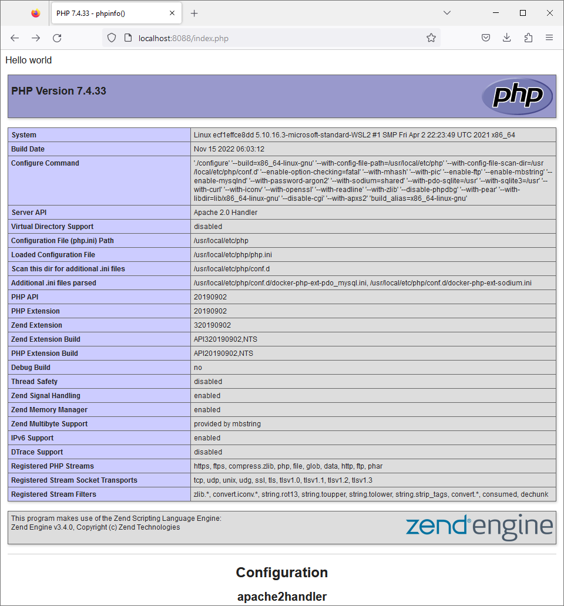
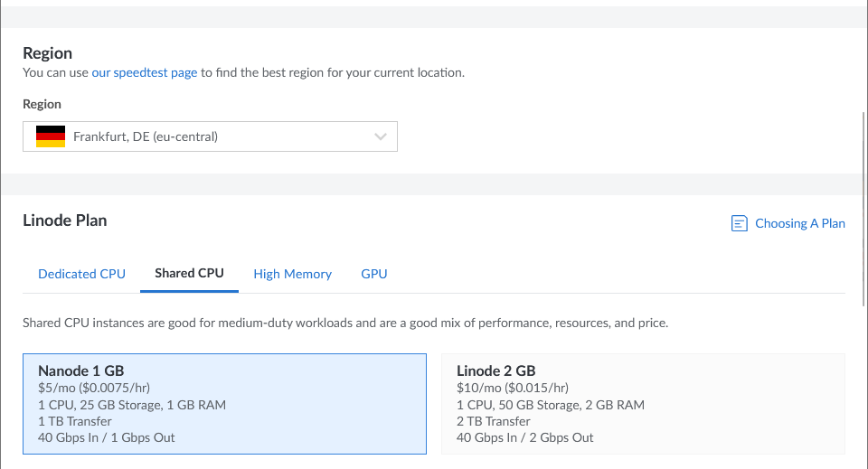
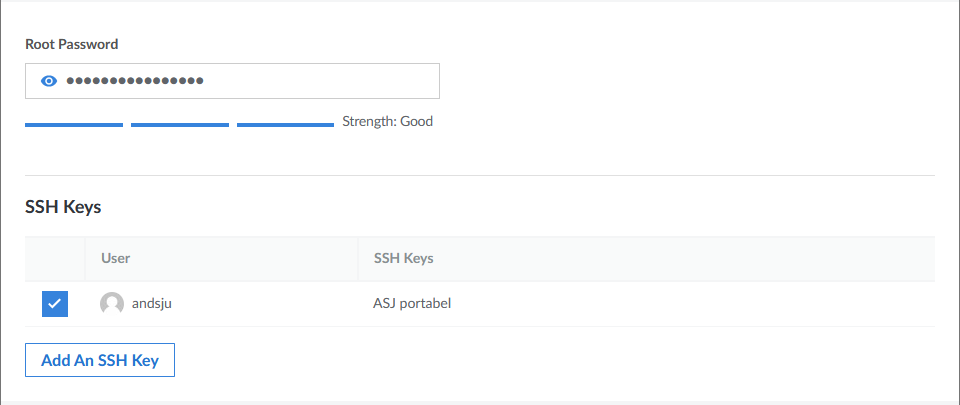
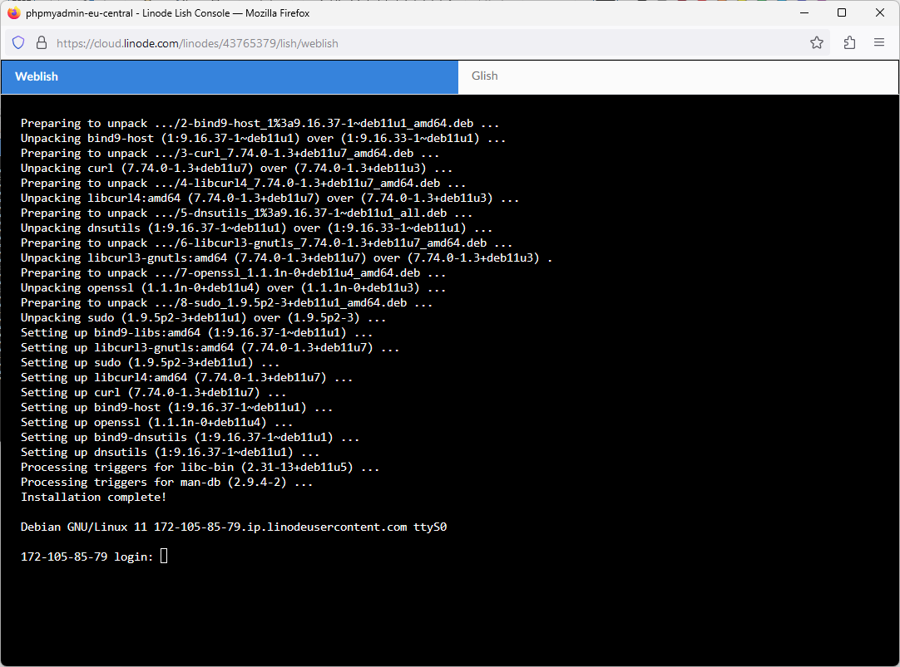
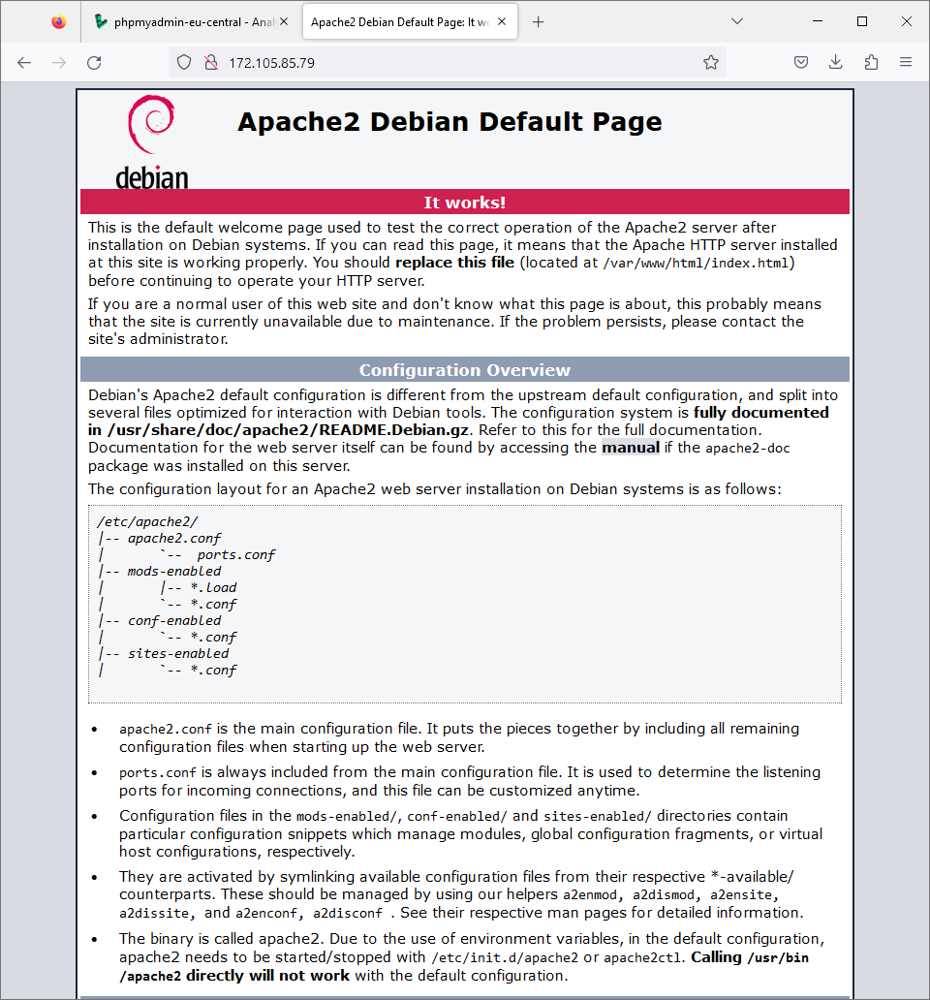
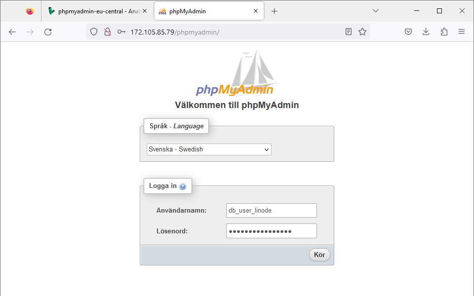
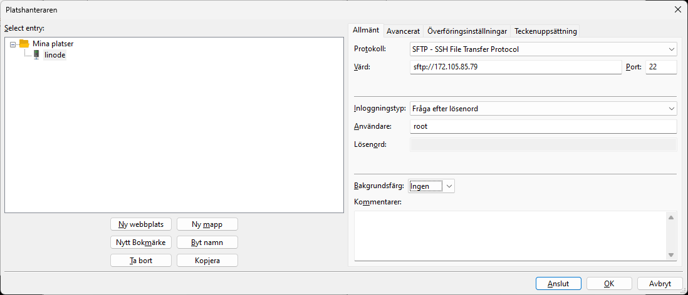
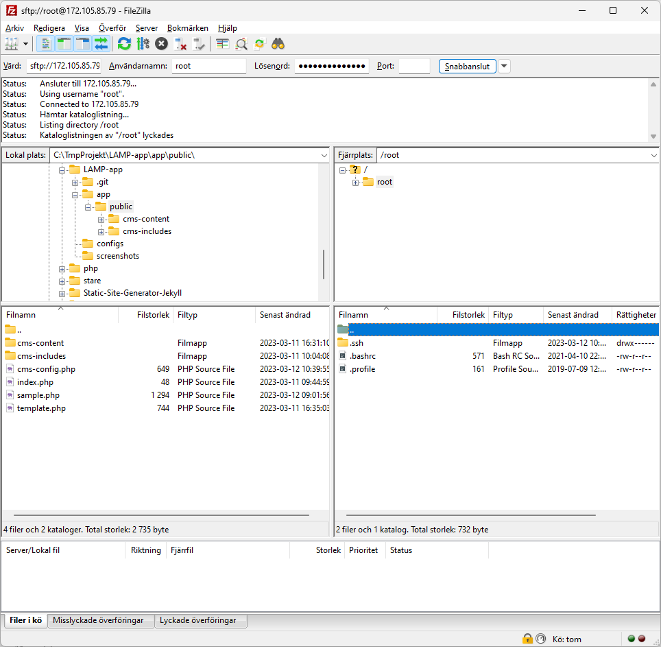
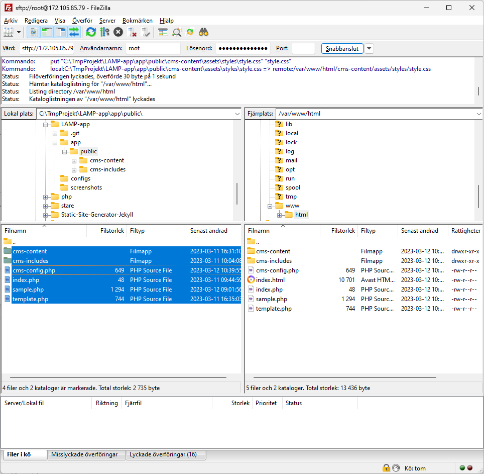
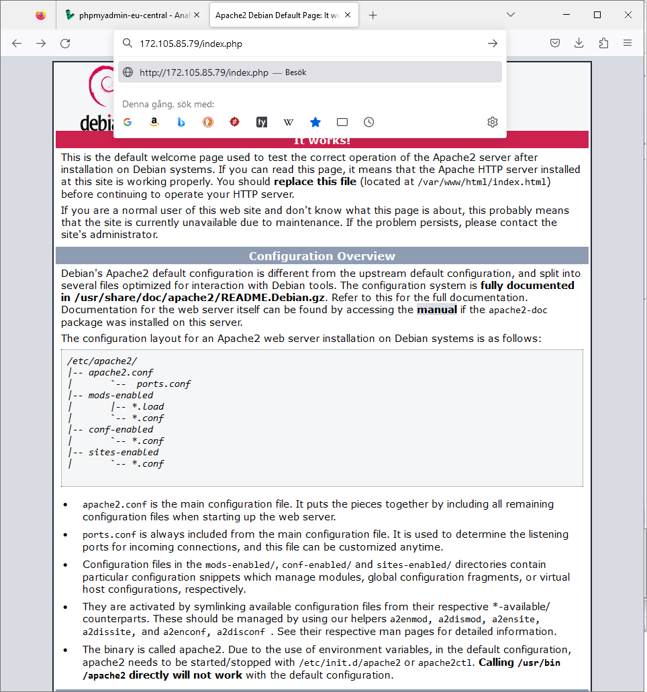

# LAMP-CMS

LAMP-CMS - ett exempelprojekt baserad på Linux, Apache, MySQL (MariaDB), och PHP.

Lokal Docker applikation testad med Linode (https://www.linode.com/) - Appen `phpMyAdmin`. Appen är en LAMP stack (PHP version 7.4).

---

Ett förslag på hur katalogstrukturen i ett CMS. Namngivning av filer, mappar, och struktur liknar Wordpress:

Jfr

- wp-content
- wp-includes
- wp-config.php

...

- cms-content
- cms-includes 
- cms-config.php

---

Mappen `public` motsvarar en webservers sökväg till: 

`/var/www/html`

Strukturen innebär att innehållet i mappen `public` enkelt kan överföras med en FTP klient till en publik webbserver. 

Används ramverk i PHP (ex composer eller Laravel), behöver applikationen även ha tillgång till `/user/share`.

---

```md

project
├── app
│   ├── public
│   │   ├── cms-content
│   │   │   ├── css
│   │   │   │   └── style.css
│   │   │   └── images
│   │   │   └── uploads
│   │   ├── cms-includes
│   │   │   ├── models
│   │   │   │   └── Database.php
│   │   │   ├── partials
│   │   │   │   └── header.php
│   │   │   ├── global-functions.php
│   │   │   └── .htaccess
│   │   └── cms-config.php
│   │   └── index.php
│   │   └── sample.php
├── configs
│   ├── custom-apache2.conf
│   └── custom-php.ini
├── docker-compose.yml
├── Dockerfile

```

I mappstrukturen ovan används `.htaccess` i mappen `cms-includes`.  

```htaccess
# Refuse direct access to all files
Order deny,allow
Deny from all
```

---

<p>&nbsp;</p>

## Docker - development

Öppna en terminal och kör kommandot:

`docker-compose up`

Starta en webbläsare och navigera till `localhost:8088`. Filen `index.php` använder `phpinfo()` för att visa gällande inställningar.



---

### phpMyAdmin

---

Navigera till  `localhost:8089`

Logga in med de uppgifter som finns i `docker-compose.yml`

*Server:* **mysql**

*Användarnamn:* **db_user**

*Lösenord:* **db_password**


När du loggat in visas den databas som skapades i samband med att instruktiner kördes i `docker-compose.yml`: **db_lamp_app**


Navigera till `localhost:8088/template.php`. 
Sidan visar header, footer och ett nav element via php include(). Sidan inkluderar filer som är användbara i en applikation.

```php
include_once 'cms-config.php';
include_once ROOT . '/cms-includes/global-functions.php';
include_once ROOT . '/cms-includes/models/Database.php';
```

Här visas också aktuell databas. Information som printas ut via databas modellen - se `/cms-includes/models/Database.php`.

Klassen Database kan andra modeller använda i applikationen.

```php
class Database {

    protected $db;

    protected function __construct() {

        $dsn = "mysql:host=". DB_HOST .";dbname=". DB_NAME;

        try {

            $this->db = new PDO($dsn, DB_USER, DB_PASSWORD);
            $this->db->setAttribute(PDO::ATTR_ERRMODE, PDO::ERRMODE_EXCEPTION);
            $this->db->setAttribute(PDO::ATTR_DEFAULT_FETCH_MODE, PDO::FETCH_ASSOC);
            $this->db->setAttribute(PDO::ATTR_PERSISTENT, true);

        } catch (PDOException $e) {
            print_r($e);
        }
    }
}


class DisplayDBVersion extends Database 
{
    function __construct() {
        
        // call parent constructor
        parent::__construct();

        $query = $this->db->query('SHOW VARIABLES like "version"');
        $rows = $query->fetch();
        
        echo '<pre>';
        echo 'Database version: ';
        foreach ($rows as $key => $value) {    
            print_r($key . ': ' . $value);
        }
        echo '</pre>';
    }
}

```

I `template.php` används metoden `DisplayDBVersion`.

```php
    <?php

    new DisplayDBVersion();

    ?>
```


---

<p>&nbsp;</p>

## Linode - production

Skapa en ny App i linode som baseras på phpMyAdmin.


Ange inställningar för applikationen.


Skapa en enkel instans av applikationen - ex *Shared CPU Nano*






När du skapat applikationen kan du via LISH console kontrollera förloppet.  




Navigera till den publika url som din applikation har. Förvalt visas Apaches startsida.



Navigera till /phpmyadmin och logga in med de uppgifter som du angav för den publika applikationen.



Skapa en ny databas (ev med samma namn som din lokala databas) 


Den tomma databasen är redo! 


Inställningar som handlar om databasen i installationsfasen ovans ska sedan anges i `cms-include.php`. Se variabler under *production*.

Med ett villkor anges vilka databasvariabler som ska vara gällande. Kontrollen använder `$_SERVER['SERVER_NAME']`. Om url:en innehåller `localhost` används namnen som återfinns i `docker-compose-yml`.

```php
// auto set database server 

// production
$db_host = "localhost"; // usually: localhost
$db_name = "db_lamp_app";
$db_user = "db_user_linode";
$db_password = "RxDhBntsV6cXUYfh";

// development (docker-compose.yml)
if (strpos($_SERVER['SERVER_NAME'], "localhost") !== false) {
    $db_host = "mysql";
    $db_name = "db_lamp_app";
    $db_user = "db_user";
    $db_password = "db_password";
}

// define constants
define("DB_HOST", $db_host);
define("DB_NAME", $db_name);
define("DB_USER", $db_user);
define("DB_PASSWORD", $db_password);

define("ROOT", $_SERVER['DOCUMENT_ROOT']);

```

---

### Överför mappstruktur till Linode App

---

För att skicka filer till den publika applikationen kan ex en FTP klient användas. Här med FileZilla (https://filezilla-project.org/).

När FileZilla är installerad ansluter du till linode. Ange:

Värd: *appens ip adress* 

Användarnamn: **root**

Lösenord: *lösenord du angav*

Port: **22**

Port 22 används för säker trafik, se det protokoll som används efter anslutning `sftp://`. 


Du kan också ange förbindelsen i Platshanteraren som FileZilla använder.



När du har loggat in med ftp klienten anger navigerar du till **Lokal plats** - din mappstruktur för ditt projekt.



I **Fjärrplats** navigerar du till den mapp som Apache förvalt använder för en webbplats:  `/var/www/html`


I mappen `/var/www/html` finns `index.html` - Apache serverns startfil.


Markera den lokala mappstrukturen och skicka innehållet till fjärrplatsen




Navigera till den publika webbplatsen 




Nu har du en lokal Docker miljö för utveckling. Produktionsmiljön uppdaterar du genom att föra över filer via ex en ftp-klient.


---

## Sample
Modell, MySQL SELCT, INSERT, UPDATE, DELETE


--- 
## Tips - visa fel i PHP
// display error

// ini_set('display_errors', 1);

// ini_set('display_startup_errors', 1);

// error_reporting(E_ALL);
